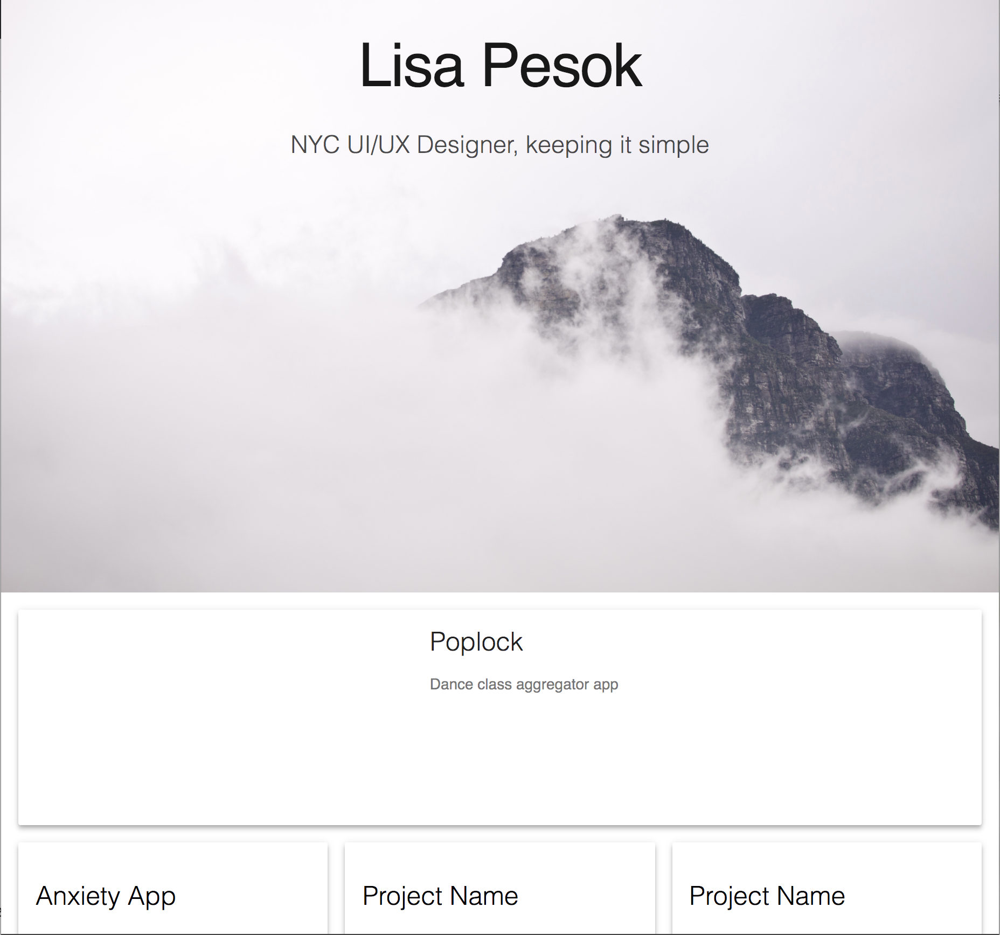
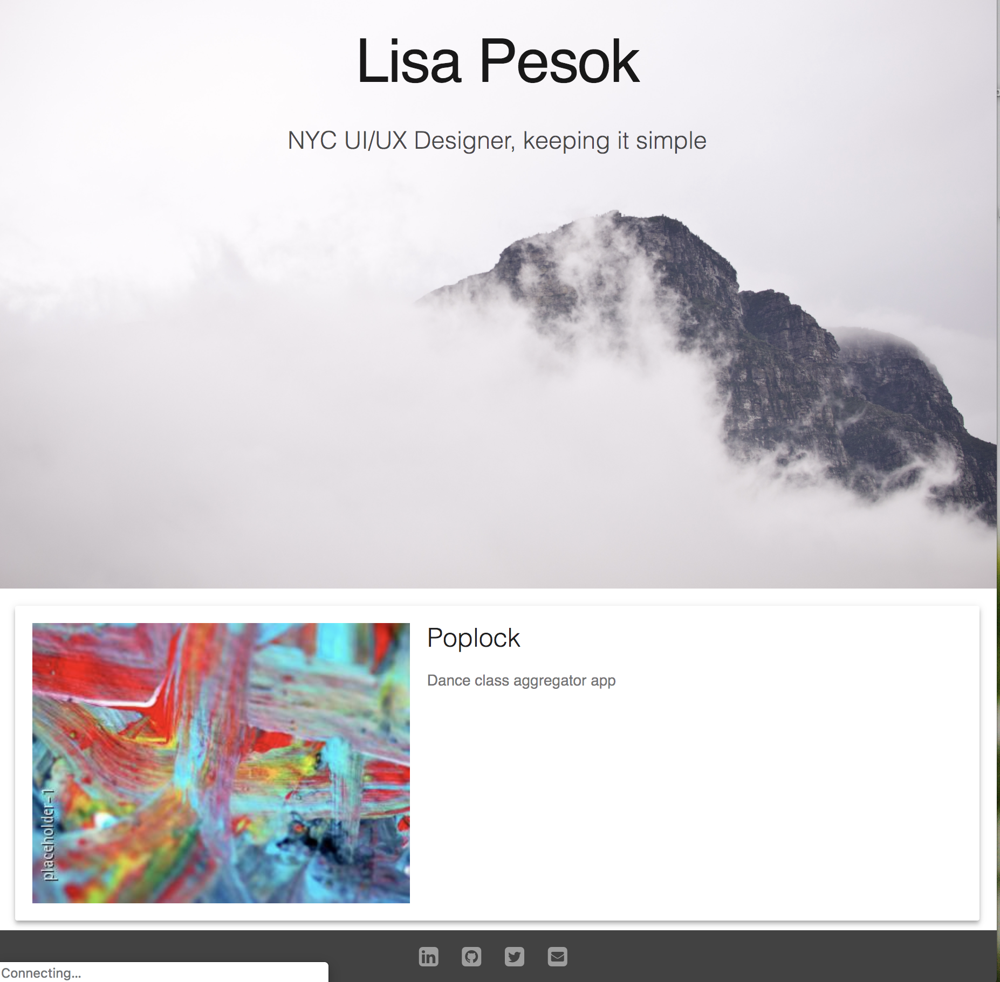

# My Portfolio

This is to be a showcase of my work during the Bloc Apprenticeship Program.

As of 12.10.18 I have built out the structure of the portfolio without any real content thus far.

The objectives of building the structure were to:
1. Determine user stories and acceptance criteria
2. Use that acceptance criteria to create HTML
3. Select components from a frontend library
4. Understand how to use CSS classes and rule sets to style a page

Please see screenshots below of the current state of the portfolio:

